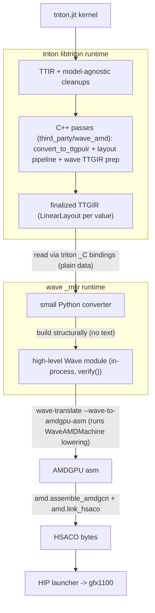

# Wave-mlir as a gated alternative AMD backend (implementation plan)

Integrate the wave-mlir compiler (`github.com/hardcode84/7`, dialects `Wave` /
`WaveAMD` / `WaveAMDMachine`) as an alternative, env-gated Triton AMD backend
named `wave_amd`, alongside the stock `hip` backend. Target: gfx1100.

## Seam decision (the core call)

**Reuse TTGIR as the wave/subgroup-level dialect.** TTGIR's "SIMT" character
lives in its *downstream LLVM lowering* (`convert_to_buffer_ops` /
`canonicalize_pointers` / `to_llvmir`), not in the dialect itself. Before those
passes, a TTGIR value is a tensor with an explicit `LinearLayout` encoding that
maps `(register, lane, warp, block) -> tensor element` -- which *is* the wave
distribution.

This reconciles with the wave design doc
(`docs/AMDGPUExplicitWaveProgrammingModel.md` in the wave repo). Its warning is
against starting from **scalar, per-work-item IR** (LLVM IR), where layouts are
gone and you must *rediscover* divergence and *re-derive* address polynomials
that were already shredded into per-thread integer arithmetic. TTGIR intercepted
*before* the address-materializing passes is the opposite:

- **Uniformity is a lookup, not a rediscovery.** A value is lane-uniform
  (wave-scalar / SGPR) iff its `LinearLayout` has zero `lane` bases; zero
  `lane`+`warp` is CTA-uniform, while zero `lane` + nonzero `warp` is a per-wave
  scalar (bound via `subgroup_id`, *not* `simd`). Corroborated by `AxisInfo`
  constancy.
- **The offset polynomial is intact.** It is recoverable from the value's
  `LinearLayout` by reading its one-hot basis vectors (`.bases[dim][i]` -- the
  contribution of each input bit; not literal `.apply` calls across the boundary,
  see M1b) -- not yet shredded. NB: a `LinearLayout` is GF(2)-linear
  (XOR of selected bases); it equals an integer-affine `index_expr` only when the
  contributing bases occupy disjoint output bits (true for simple global blocked
  loads -- the MVP). XOR-swizzled shared/dot layouts are not affine and are out of
  scope for the `index_expr` path.
- Masks live as `tensor<i1>` + `select`; ordering lives in MLIR side effects.

Locked seam:

- **Source IR = TTGIR**, finalized by Triton's own layout pipeline.
- **Reuse the entire layout logic by running it** (propagation, coalesce,
  accelerate-matmul) inside a C++ pass stage in the triton repo. No vendoring,
  no copy-paste; layouts stay in triton.
- **TTGIR -> Wave handoff = a small Python converter that builds Wave IR
  structurally via bindings (no text).**
- **wave-mlir repo gets only additive, upstream-able changes** -- no LLVM
  unification, no C++ linking, no Triton awareness. The MVP and cross-lane-via-LDS
  need only Python bindings (the roadmap's in-process emit adds one); general lane
  permutation may later need one additive high-level wave op (see roadmap).

Why the bridge is Python and not C++ or text: triton's `libtriton` (its LLVM
pin) and wave's `_mlir` extension (its LLVM pin) cannot share C++ objects, so the
converter cannot be a C++ pass. It must not be text either (string-templating
Wave IR across the semantic gap is lossy/fragile). Python is the one place both
sealed runtimes coexist: read TTGIR via triton's `_C` bindings, build Wave IR via
wave's `mlir` package, and pass only plain data (bases, shapes, dtypes, offset
polynomials) across -- never MLIR handles.

## Thesis validation (code + fixtures, no execution)

The load-bearing assumption -- finalized TTGIR is a valid wave/subgroup IR -- was
checked against the code and Triton's own lit fixtures (no compile needed):

- **Dims map cleanly.** A blocked layout is built as `register(sizePerThread) x
  lane(threadsPerWarp) x warp(warpsPerCTA)`
  (`lib/Dialect/TritonGPU/IR/LinearLayoutConversions.cpp:908`), so `lane` = lane
  in a wave (32 on gfx1100) and `warp` = wave/subgroup. (`block` = CTA, trivial
  at `num_ctas=1`.)
- **Lane-uniformity = zero `lane` bases** (broadcast), per
  `include/triton/Tools/LinearLayout.h:778` (`getFreeVariableMasks`: all free vars
  0 => injective; broadcast example at `:144`). Both IR forms appear: scalar SSA
  (`%0 = tt.get_program_id x : i32`) and splat-of-scalar
  (`tt.splat %1 : i32 -> tensor<256xi32, #blocked0>`) in
  `test/TritonGPU/amd/amd-convert-buffer-ops.mlir:10,13`.
- **Offset polynomial intact at the interception point:**
  `tt.addptr(tt.splat(base), pid*256 + tt.make_range)` then `tt.load %ptr`, all
  tensor-level + layout-annotated (`amd-convert-buffer-ops.mlir:10-31`). The
  shredding is the *downstream* `ConvertToBufferOps` pass (`tt.load ->
  BufferLoadOp`, `tt.store -> BufferStoreOp`, via AxisInfo/RangeAnalysis;
  `third_party/amd/lib/TritonAMDGPUTransforms/ConvertToBufferOps.cpp:500,540,613`).
- **Masks are `tensor<i1>`** carried as the load/store operand
  (`%cst = dense<true> : tensor<64x64xi1, #blocked1>`; `tt.load %10, %cst, ...`;
  `test/TritonGPU/coalesce.mlir:25,47`) -> `wave.where`.
- **`convert_layout` boundary:** a same-layout elementwise copy has zero
  `ttg.convert_layout`; it appears only when operands need different lane
  mappings -- transpose (`coalesce.mlir`, 15x) and dot operands
  (`dot-operands.mlir`, 6x). That is the first construct needing cross-lane
  movement (LDS roundtrip, or `read_first` for the broadcast special case), i.e.
  more than a 1:1 op map.

Verdict: HOLDS for the elementwise masked-copy MVP. First thing beyond it that
needs more than a 1:1 wave mapping: a `ttg.convert_layout` (reductions,
transposes, dot operands) -- where the bridge must emit cross-lane ops, not a
straight per-op translation. That layout-conversion *codegen* (not op
translation) is the real design problem beyond the MVP; see the roadmap's
`invertAndCompose` sketch.

## Reuse of the Triton pipeline

- **Run wholesale (model-agnostic + layout):** `inliner`, `canonicalizer`,
  `CSE`, `symbol_dce`, `triton_licm`, `loop_unroll`, `combine`,
  `reorder_broadcast`, `rewrite_tensor_descriptor_to_pointer`, then
  `convert_to_ttgpuir` and the full layout machinery -- `coalesce`
  (`lib/Dialect/TritonGPU/Transforms/Coalesce.cpp`), layout propagation
  (`LayoutPropagation` in
  `lib/Dialect/TritonGPU/Transforms/RemoveLayoutConversions.cpp`), and, for
  gfx1100, the AMD matmul pass `amd.passes.ttgpuir.add_accelerate_matmul`
  (`third_party/amd/lib/TritonAMDGPUTransforms/AccelerateAMDMatmul.cpp`, emits
  `AMDWmmaEncodingAttr`). NB: the core
  `lib/Dialect/TritonGPU/Transforms/AccelerateMatmul.cpp` is NVIDIA-MMA only and
  is not in the AMD pipeline. These produce a finalized `LinearLayout` on every
  value, which the converter consumes. The only stable contract is this *pass
  pipeline order* + the per-value `LinearLayout` output -- not pass internals
  (`LayoutPropagation` is an anonymous-namespace class in
  `RemoveLayoutConversions.cpp`); pin the consumed pipeline so output-schema drift
  is reviewable.
- **Do not run (SIMT commitment / duplicates wave's machine layer):**
  `convert_to_buffer_ops` / `canonicalize_pointers`, `schedule_loops` /
  `pipeline` / `block_pingpong`, `to_llvmir` / `allocate_shared_memory`. We stop
  at finalized TTGIR; wave-mlir owns scheduling, regalloc, waitcnt and emission.

## Verified facts (recon)

- **Two sealed natives coexist in one interpreter:** `triton/_C/libtriton.so`
  and wave's `_mlir.so` export 0 `llvm::` / `mlir::` symbols (static link, hidden
  visibility). A minimal smoke (both MLIR contexts + Triton `llvm.init_targets()`
  in one Python 3.12 process) passed, but this stays a committed CI gate (M0.5),
  not a one-off -- the real two-LLVM load is first load-bearing at M2. The
  LLVM-pin delta (wave `f8fcded5` vs triton `62b7cf96`) is irrelevant for the
  *in-process handle* boundary (plain data only). It is **not** irrelevant for the
  asm->HSACO handoff: that is a cross-toolchain contract (AMD code-object version,
  `.amdhsa_*` directives, kernarg metadata) two different LLVM AMDGPU backends must
  agree on -- validated in M0, with wave's in-process `assembleWaveAMDGPUKernels`
  (HSACO directly) as the fallback if Triton's assembler disagrees.
- **Wave bindings are built for structural construction**
  (`python/WaveExtensionNanobind.cpp`): `register_dialects(context, load=True)`
  (the comment notes this exists so a Python-built module can be round-tripped
  through the WaveAMDMachine pipeline), `register_passes()` (so wave's pipeline
  runs via `PassManager` in-process), Wave types `SimdType` / `MaskType` /
  `MemTokenType` / `PtrType` / `FragmentType` (role, rows, cols, wave_size,
  registers), and the symbolic attrs `ExprAttr` (for `wave.index_expr`) and
  `PredAttr`. Op vocabulary in `include/mlir/Dialect/Wave/IR/WaveOps.td`:
  `workgroup_id` / `subgroup_id` / `lane_id`, `splat`, `binary` / `fadd` /
  `fmul` / `fma`, `index_expr`, `ptr_add`, `load` / `store`, `where`, `select`,
  `assume` / `read_first` / `ballot`, `token` / `after` / `join` / `wait`.
- **Wave examples build structurally then only stringify for the CLI**
  (`examples/wave/wmma_matmul_tiled.py`: `from mlir.dialects.wave_matmul import
  ...` then `module_text = str(module)` -> `wave-opt` / `wave-translate`). We keep
  the module in-process. Construction uses the generated ODS `OpView` wrappers
  (tblgen-generated at build, so not in the source tree; imported via
  `python/mlir/dialects/wave.py`'s `from ._wave_ops_gen import *`, re-exported from
  `mlir.dialects.wave` / `waveamd`) and the higher-level `wave_dsl` helpers --
  not generic `Operation.create`. The converter reuses these wrappers; they
  encode the verifier constraints (e.g. `index_expr` needs an `ExprAttr` plus a
  bijective `StrArrayAttr` of names; `assume` needs a `PredArrayAttr`). Symbolic
  offsets/predicates are built structurally with `ixsimpl` and imported via
  `ExprAttr`/`PredAttr.get_from_node_ptr` (`python/mlir/dialects/wave_dsl.py:827,111`)
  -- so the offset algebra crosses as structure, not text.
- **Triton layout read:** `toLinearLayout(RankedTensorType)`
  (`include/triton/Dialect/TritonGPU/IR/LinearLayoutConversions.h`) +
  `LinearLayout::getBases()` (`include/triton/Tools/LinearLayout.h`). The Python
  `LinearLayout` class is bound in `python/src/linear_layout.cc` with `.bases`
  and `.apply` (plus `compose` / `invert` / `invert_and_compose` / `from_bases`;
  `invert_and_compose` is the convert_layout-delta primitive the roadmap uses). The
  existing
  `to_linear_layout` in `python/src/gluon_ir.cc` is *insufficient*: it is a
  `GluonOpBuilder` method taking `(Attribute, shape)` and returns a Gluon
  wrapper, not a `LinearLayout`. So M1b adds one minimal binding wrapping
  `triton::gpu::toLinearLayout(RankedTensorType)` that returns the bound
  `LinearLayout`.
- **C++ TTGIR passes in the triton repo are precedented:** the prior branch built
  `third_party/wave_amd/backend/passes/*` (`ConvertToTTGPUIR`, `AccelerateMatmul`,
  `LegalizeDots`, `PlanGemmSchedule`, `PlanBufferDescriptors`) against triton's
  LLVM, registered into triton-opt.
- **Emit + back-half:** `wave-translate --wave-to-amdgpu-asm -` consumes a Wave
  module under `module attributes {waveamdmachine.target =
  "amdgcn-amd-amdhsa--gfx1100"}` (`examples/wave/common.py`,
  `tools/wave-translate/wave-translate.cpp`; the flag is registered in
  `lib/Target/Wave/TranslateRegistration.cpp` and is the only translate variant
  -- no hsaco CLI flag). Reuse Triton's `amd.assemble_amdgcn`
  (`(asm, arch, features) -> object bytes`) + `amd.link_hsaco` (input/output
  *file paths*) from `from triton._C.libtriton import amd`, then the HIP launcher.
- **Runtime ready (re-verified):** gfx1100 present (`/dev/kfd`; `rocminfo` ->
  `gfx1100`); wave tools built (`build/bin/wave-opt`, `build/bin/wave-translate`,
  `build/llvm-install/bin/mlir-runner`,
  `build/share/wave-mlir/pipelines/pipelines.mlir`). Triton is not pip-installed
  -- `import triton` (3.7.0) needs `PYTHONPATH=/home/vano/triton/python` (or a
  wheel install). The C++ pass stage requires a triton build; the rest of the
  backend is in-tree Python (`TRITON_BACKENDS_IN_TREE=1`).
- The prior `wave` branch is ignored as a base: it stalled at a 2421-line hand
  TTIR->Wave bridge and never closed the hardware loop or went in-process.

## Data flow



## Bridge mapping (elementwise MVP)

- `tt.get_program_id` -> `wave.workgroup_id` (+ `subgroup_id` / `lane_id`).
- `tt.make_range` / `tt.splat` / `arith.*` / `tt.addptr`: fold the offset DAG,
  then derive the per-`(lane, reg)` offset polynomial from the value's
  `LinearLayout` by reading `.bases` (each input bit's contribution; assert the
  contributing bases are bit-disjoint so the result is affine) and emit
  `wave.index_expr` (`ExprAttr`) + `wave.ptr_add`.
- **Uniformity** from the layout: zero `lane` bases -> scalar (SGPR; per-wave and
  bound via `subgroup_id` when `warp` bases are nonzero); nonzero `lane` bases ->
  `!wave.simd<T,W>`.
- `tt.load` / `tt.store` with mask -> `wave.load` / `wave.store` guarded by a
  region-based `wave.where` (`ins Wave_Mask $condition`, then/else regions with an
  implicit `wave.yield`). Op shapes: `wave.load` returns *two* results
  (`Wave_Simd $value`, `Wave_MemToken $token`); `wave.store` takes `$value` first
  and returns a `$token`. `tt.load`'s `other` (off-lane default) maps to the
  `wave.where` else region (or a trailing `wave.select`); a non-compare
  `tensor<i1>` mask must be materialized to `!wave.mask` (only `wave.cmpi` produces
  one directly). Derive the payload `vector<N x T>` width from the contiguous
  `register` bases, clamped to wave's legal widths (whole 32-bit dwords / 16-bit
  ops). The MVP mask is a single `offsets < n` -> one `wave.cmpi`; compound /
  loaded / splat-`i1` masks (no mask-algebra or i1->mask cast exists) are out of
  MVP scope.
- `wave.index_expr` is `(ExprAttr $expr, StrArrayAttr $names, Variadic $bindings)
  -> IndexValue`, with free-symbols(`$expr`) == set(`$names`). Build it with wave's
  structured DSL `bld.index_expr(expr, bindings={sym: ssaValue})` over `ixsimpl`
  `Expr`s (no text); uniformity flows from each binding's operand type (uniform
  scalar vs `simd`).
- Memory ordering: the MVP emits **no** tokens -- in/out are distinct buffers (no
  hazard) and load->store readiness rides the SSA value dep (the lowering inserts
  the `vmcnt` wait). See "Memory token generation" for when/how tokens are made.
- Divisibility / range facts -> `wave.assume`.

## Memory token generation

`!wave.mem.token` is an explicit happens-before SSA graph layered over the MLIR
`MemRead`/`MemWrite` effects (`include/mlir/Dialect/Wave/IR/WaveOps.td`):
`wave.load` returns `(value, token)`, `wave.store` returns a `token`, and both
take an optional `after` dependency; `wave.token` mints an empty one,
`wave.after` / `wave.join` combine, `wave.wait` forces completion, and
`wave.barrier [deps] -> token` is the LDS visibility fence (`s_waitcnt
lgkmcnt(0)` + `s_barrier` on RDNA3). The DSL surfaces all of these:
`fb.load(ptr, ty, after=...)`, `fb.store(v, ptr, after=...)`,
`fb.barrier(*deps)`, `fb.wait(*toks)`, `fb.token()`, `fb.after(...)`,
`fb.join(...)`.

TTGIR has none of this -- its ordering is implicit (program order + memory
effects) -- so the converter must *materialize* implicit ordering into explicit
tokens, but **only where a real happens-before exists**; a blanket chain would
needlessly serialize. Two concerns are separate:

- **Value readiness (`vmcnt`) is not a token concern.** The loaded SIMD value's
  wait is inserted by the WaveAMDMachine lowering from the *value use*, not from a
  token. Validated in M3: with no token threaded, the emitted asm still has
  `s_waitcnt vmcnt(0)` between the `global_load_b32` and the `global_store_b32`
  that consumes it.
- **Memory-to-memory ordering** (RAW / WAW / WAR through memory, with no SSA value
  link between the two ops) is exactly what tokens express.

MVP reality (elementwise masked-copy, and saxpy): emit **no** tokens. In/out are
distinct buffers (no hazard), and the only ordering -- load before the store that
consumes its value -- is already carried by the SSA data dependency. saxpy's two
loads *should* stay un-chained so they overlap; the single wait before first use
is the backend's job. M2/M3 confirm tokenless converter output is correct, so the
MVP is tokenless *by design*, not as a shortcut.

Generation strategy when scaling past distinct-buffer elementwise: during the
walk track, per memory resource (keyed by base-pointer SSA value / kernarg), the
last store token and any outstanding load tokens.

- load from B: `after =` last-store-token(B) if it may alias; else none (reads
  don't block reads).
- store to B: `after = join(`prior store + outstanding load tokens to B that may
  alias`)`; then set last-store(B).
- distinct kernarg pointers -> treated as non-aliasing -> no edge; when
  disjointness is unprovable, fall back to a conservative per-buffer chain
  (correctness over overlap).

The case that *forces* tokens is cross-lane layout conversion via LDS (the
`convert_layout` roadmap item): the store, the barrier, and the read are ordered
only by tokens -- there is no value link across the LDS round-trip --

```python
t0     = fb.store(regs, lds_ptr)              # wave.store -> token
t1     = fb.barrier(t0)                        # store visible to all lanes -> token
val, _ = fb.load(lds_ptr2, simd_ty, after=t1)  # read sequenced after the barrier
```

So token generation lands with the LDS staging path (and in-place / atomic
cases), not before. The per-resource tracker above is the foundation those build
on; the elementwise slice ships without it.

## Milestones

- **M0 back-half smoke (no bridge):** build `wave-opt` / `wave-translate` /
  `mlir-runner`; take a known-good *high-level* Wave module from `examples/wave`
  (e.g. the simplest one that still packs real kernargs, such as saxpy),
  emit asm with `wave-translate --wave-to-amdgpu-asm` (which runs the WaveAMDMachine
  lowering -- do not pre-run the `common.py` to-LLVM pipeline, that path targets
  `mlir-runner`), then `amd.assemble_amdgcn` + `amd.link_hsaco`, and load + launch
  via Triton's HIP driver on gfx1100, asserting output vs a host reference. Proves
  emit + assemble + link + launch independent of the bridge, and -- critically --
  validates the asm->HSACO code-object contract and the **kernarg ABI**: wave
  defines its own kernarg layout (`include/mlir/Dialect/Wave/IR/WaveAMDABI.h`),
  which must match (or be adapted to) what Triton's HIP launcher packs. Pin the
  exact `wave-translate` command here for M2b to reuse.
- **M0.5 in-process coexistence gate:** (prereqs: built `libtriton.so` + Triton on
  `PYTHONPATH`, wave's `mlir` package) in one process, `import triton._C`
  (+ `llvm.init_targets()`) **and** wave's `mlir`, create both contexts,
  `register_dialects` / `register_passes`, build + `verify()` a trivial Wave
  module. Gates the two-LLVM risk *before* the converter exists (M0 runs
  `wave-translate` as a subprocess, so it does not exercise in-process coexistence).
- **M1 gated backend skeleton + TTGIR stage:**
  `third_party/wave_amd/backend/{compiler.py, driver.py}`. Discovery scans
  `python/triton/backends/*` (keyed off the *directory name*, reads only those two
  files; `name.conf` is not read by `python/triton/backends/__init__.py` -- it
  matters only for external install via `setup.py` `copy_externals`), so
  `third_party/wave_amd/backend` must be linked in as
  `python/triton/backends/wave_amd` (add `wave_amd` to `BackendInstaller.copy([...])`
  in `setup.py`, or symlink manually) -- an M1 prerequisite, not roadmap.
  `_find_concrete_subclasses` raises on **>1** concrete subclass in a module, so do
  *not* bind the concrete parent at module scope: `import triton.backends.amd.driver
  as _amd; class WaveAMDDriver(_amd.HIPDriver)` (same for `compiler.py` vs
  `HIPBackend`). All wave / `_mlir` imports must be **lazy** (inside methods, after
  the gate) -- the discovery import is eager for every in-tree backend, so a
  top-level wave import would load the second LLVM into every `import triton`.
  `WaveAMDBackend(BaseBackend)` must implement the abstract surface
  (`supports_target`, `hash`, `parse_options`, `add_stages`, `load_dialects`,
  `get_module_map`) plus the framework-used `binary_ext="hsaco"` / `pack_metadata` /
  `get_codegen_implementation`. Stages `ttir -> ttgir -> wave -> amdgcn -> hsaco`.
  The `ttgir` stage runs the reused layout pipeline plus minimal wave TTGIR prep
  via C++ passes in `third_party/wave_amd/backend/passes/` (registered into
  triton-opt; ship a lit test for this stage). `WaveAMDDriver(HIPDriver)`'s
  `is_active()` must require **both** `TRITON_WAVE_AMD_ENABLE=1` *and*
  `TRITON_DEFAULT_BACKEND=wave_amd` -- returning True on only one would make two
  drivers active when `TRITON_DEFAULT_BACKEND` is unset, and the runtime raises on
  `!= 1` active driver, breaking even stock `hip`; target `GPUTarget("wave_amd",
  "gfx1100", 32)`. Register via `TRITON_BACKENDS_IN_TREE=1`.
- **M1b layout read into Python:** add one minimal binding exposing
  `triton::gpu::toLinearLayout(RankedTensorType) -> LinearLayout` (the
  `gluon_ir.cc` `to_linear_layout` returns a Gluon wrapper, not a `LinearLayout`,
  so it cannot be reused) so the converter reads each value's finalized layout as
  plain integer bases via `.bases` and computes offsets in Python. Avoid `.apply`
  across the boundary -- it rebuilds query `StringAttr`s from a singleton context
  that may differ from the layout's.
- **M2 structural Python converter (no text):** a small module that holds triton
  `_C` bindings (read finalized TTGIR) and wave's `mlir` package
  (`register_dialects`, build ops). Covers the elementwise mapping above; produces
  an in-process Wave module, gated on `module.operation.verify()` succeeding
  (decouples converter correctness from emit).
- **M2b emit:** feed the verified high-level Wave/WaveAMD module to `wave-translate
  --wave-to-amdgpu-asm`, which runs the staged WaveAMDMachine lowering and emits asm
  -- it is codegen, not a serialize, so do **not** pre-run the `common.py` to-LLVM
  pipeline (that path feeds `mlir-runner`). Reuse the exact command pinned in M0.
  `register_passes` + `PassManager` is reserved for an optional in-process
  `verify()` / `mlir-runner` numeric check.
- **M3 close the loop:** wire the converter into the `wave` stage, compile the
  masked-copy kernel, launch on gfx1100, assert output matches a masked-copy
  reference. The milestone the prior attempt never reached.

## Roadmap (after the slice)

- **Matmul:** the WMMA fragment register layout is HW-defined by the matrix
  instruction, and Triton already produces it (`AMDWmmaEncodingAttr`) to lower
  `tt.dot` to LLVM -- so the reuse is *structurally correspondent* (both encode the
  same HW fragment), pending a verified per-lane register-order equality:
  `AMDWmmaEncodingAttr` (a tensor `LinearLayout`) must be shown to match wave's
  `FragmentType` packing element-for-element (a fixture cross-checking wave's
  fragment element order against Triton's `AMDWmmaEncodingAttr` `LinearLayout` via
  `.bases` -- a wave-side `fragment_pack`/`unpack` round-trip is an identity rename
  and proves nothing) before relying on it. The converter is then coupled to
  `AccelerateAMDMatmul`'s output schema (wmma version, `kWidth`, transpose flags),
  which can churn. Targets: `waveamd.mma` / `waveamd.mma_scale` (matrix-core op with
  a `kind` string, e.g. `"wmma"` on gfx1100;
  `include/mlir/Dialect/Wave/IR/WaveAMDOps.td`), via `fragment_pack` /
  `fragment_unpack` / `fragment_fill`; loop / branch token threading.
- **`convert_layout` / cross-lane synthesis (the real layout problem) -- SHIPPED
  (affine, single + multi-warp):** when src
  and dst `LinearLayout`s differ, compute the delta
  `srcLL.invert_and_compose(dstLL)` (the same primitive Triton uses to lower
  `convert_layout` to LLVM) and classify: intra-lane reg permutation (free),
  cross-lane, or cross-warp (LDS write + `wave.barrier` + read). NB: the high-level
  wave dialect has **no** general lane-shuffle/permute op -- only `wave.read_first`
  (broadcast first active lane) and `wave.ballot` (mask); general lane permutation
  lives only at the `WaveAMDMachine` level, which the converter does not build. So
  cross-lane must either use the LDS roundtrip (expressible today, bindings-only)
  or motivate one new additive high-level wave op lowering to the machine `ds-lane`
  ops. Classification is the easy step; delta->hardware-op *emission* is the real
  cost (Triton needs dedicated swap/ship + generic-swizzling impls). Gates
  reductions / transposes / dot operands.
  - **Shipped in the converter** (`third_party/wave_amd/backend/wave_converter.py`;
    tests `third_party/wave_amd/test/{transpose_e2e,transpose_mw_e2e,strided_copy_e2e}.py`,
    recon `spike_recon{,2}.py`): the spike (a bespoke per-kernel converter, now
    retired) generalized into the production `convert`. A 32x32 transpose -- one
    `ttg.convert_layout`, a `register`<->`lane` reshuffle -- runs through the real
    `make_wave` and is correct on gfx1100 (`y == x^T`); a `num_warps=2` 32x32 and
    64x64 transpose (the convert delta now also moves the `warp` dim) is correct
    too. What it establishes:
    - The roundtrip is **bindings-only and small**: per register slot, global
      `wave.load` -> `wave.store` to `wave.lds_base` + `flatten(srcLL)` ->
      `wave.barrier(join(stores))` -> `wave.load(after=barrier)` from `lds` +
      `flatten(dstLL)` -> global `wave.store`. No `WaveAMDMachine` op, no C++.
    - Addresses come straight from **`.bases`, not `.apply`** (`.apply` aborts
      across the singleton/layout context boundary, confirming the M1b note). The
      converter synthesizes the general affine offset per `(register, lane, warp)`
      from the bases (constant + per-lane-bit shift/mask/mul + masked `warp_id =
      workitem_id >> log2(W)`), so runtime strides and bit-interleaved lanes fall
      out for free -- not just the spike's clean `cL*lane + const` case. Index and
      pointer values stay **symbolic** (an affine `Lin` over coordinates) so
      `broadcast` / `expand_dims` / `trans` are bookkeeping and SIMD is emitted
      only at `cmpi` / `load` / `store`.
    - A **naive, unswizzled** row-major shared layout is *correct* (Triton's
      `optimalSwizzlingLdSt` / `GenericSwizzling` is a bank-conflict *perf*
      optimization, not a correctness requirement), and spans the full workgroup
      tile so cross-warp deltas land via the workgroup-wide `s_barrier`.
    - **Tokens are load-bearing.** The threaded `store -> barrier -> load(after=)`
      chain is what makes wave-translate emit the `s_waitcnt lgkmcnt(0)` +
      `s_barrier` fence (the cross-warp fence at `num_warps>1`); drop it and the
      kernel races. (Validates the "Memory token generation" design.)
  - **Still open (deferred, not disproven):** non-affine XOR-swizzled deltas (dot
    operands, bank-optimal shared) -- addresses are not clean-affine, so the
    bases-driven affine synthesis raises rather than miscompiling; bank-conflict
    swizzling for perf; and packing the per-register unroll into `vector<N>`
    loads. Multi-CTA (`block` in the delta) stays out of scope.
- **Fully in-process emit:** add a nanobind over `translateWaveToAMDGPU` (asm, runs
  the lowering pipeline) or `assembleWaveAMDGPUKernels` (HSACO directly -- but the
  caller must first run the WaveAMDMachine lowering in-process via `register_passes`
  + `PassManager`, so it is *not* a drop-in swap) -- both in the wave repo
  `include/mlir/Target/Wave/AMDGPU.h` -- to drop the final `wave-translate`
  subprocess.
- **Grow coverage:** strided copy, elementwise binary, reductions, transposes.
- **Productionize registration:** external (out-of-tree) install via `name.conf` +
  `setup.py` `copy_externals`, plus package data (the in-tree symlink lands in M1).

## Key risks / mitigations

- **Layout-derived `wave.index_expr`:** build the offset polynomial (affine in
  lane / reg / workgroup) with wave's structured DSL builder `bld.index_expr`
  (`python/mlir/dialects/wave_dsl.py:790`) over `ixsimpl` symbolic `Expr`s, imported
  via `ExprAttr.get_from_node_ptr` (`wave_dsl.py:827`; no text). Validate
  loads/stores cover the block exactly before generalizing.
- **Building Wave ops:** use the generated ODS `OpView` wrappers
  (`mlir.dialects.wave` / `waveamd`) and `wave_dsl` helpers, which encode op
  verifier constraints; avoid generic `Operation.create` (it works in-memory but
  forces you to hand-satisfy attrs like `index_expr`'s bijective `$names` and
  `select`'s custom assembly format).
- **Two MLIR Python libs in one process:** keep a committed M0.5 coexistence gate
  (not a one-off); make all wave / `_mlir` imports lazy (the in-tree discovery
  import is eager); keep a robust import order and never force `RTLD_GLOBAL` (one
  dependency that dlopens with it breaks the process). Pass only plain data across
  the boundary -- never `Mlir*` capsules.
- **Implicit mask / token recovery:** TTGIR carries masks as `tensor<i1>` and
  ordering as MLIR side effects; reconstruct `wave.where`, and materialize memory
  tokens only on real hazards / LDS staging (see "Memory token generation") -- the
  elementwise MVP needs none.
- **Emit input** must be high-level Wave / WaveAMD ops under
  `waveamdmachine.target`.
- **Launch / kernarg ABI (critical):** wave defines its own kernarg layout
  (`KernargSlot` / `getKernargLayout` in `WaveAMDABI.h`) and its reference launcher
  uses the HIP `kernelParams` array-of-pointers convention with block dims from a
  `gpu.known_block_size` attr; Triton's HIP launcher uses the *mutually exclusive*
  packed `extra` config-buffer convention (`kernelParams=NULL`), Triton-ordered
  (with implicit args like the global-scratch pointer), block from
  `num_warps * warp_size`. These are different HIP calling conventions, not just
  byte order -- M0 must assert a wave kernel launches correctly via Triton's
  launcher, else emit a wave-specific launcher stub / adapter. Minimal metadata
  otherwise: `shared=0`, scratch=0, `warp_size=32`.
